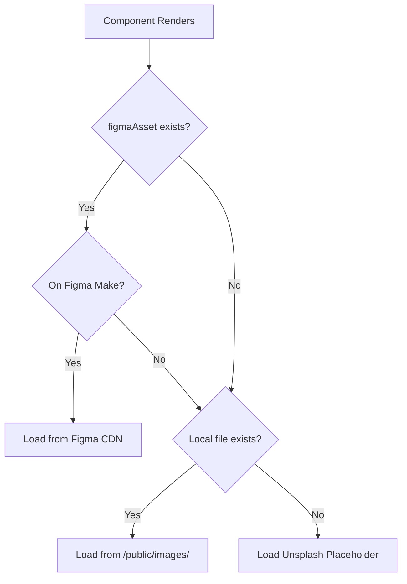

# 🎉 Image Loading Solution - Complete!

## Problem yo'q endi! ✅

Siz loyihani **hech qanday rasmlar yuklamasdan** ishlatishingiz mumkin. Avtomatik fallback mechanism o'rnatildi.

---

## 🔧 What Was Done

### 1. **Adaptive Image System**

Created three-tier image loading:

```
1. Figma CDN (figma:asset)     → Figma Make platformasida
2. Local /public/images/        → Development
3. Unsplash Placeholder         → Automatic fallback
```

### 2. **Updated Files**

#### **Core Files:**
- ✅ `/utils/imageResolver.ts` - Added Unsplash fallback logic
- ✅ `/components/AdaptiveImage.tsx` - Smart image loader with error handling
- ✅ `.gitignore` - Configured for optional image tracking

#### **Component Updates:**
- ✅ `/components/Hero.tsx` - Uses AdaptiveImage with fallback
- ✅ `/components/Feedback.tsx` - Uses AdaptiveImage with fallback
- ✅ `/components/PricingTable.tsx` - Uses AdaptiveImage with fallback
- ✅ `/pages/DashboardPage.tsx` - Added filename prop to AdaptiveImage

#### **Documentation:**
- ✅ `/QUICKSTART_NO_IMAGES.md` - Quick start without images
- ✅ `/SERVER_IMAGE_FIX.md` - Server deployment guide
- ✅ `/deploy.sh` - Automated deployment script
- ✅ `/check-server-images.sh` - Diagnostics script
- ✅ `/nginx-config-fix.conf` - Updated Nginx config
- ✅ `/public/images/.gitkeep` - Git tracking for images folder

---

## 🚀 How It Works

### **Local Development:**

```bash
npm install
npm run dev
```

**Browser opens → Images automatically load from Unsplash!** 🎉

### **Image Loading Flow:**



### **Browser Console Logs:**

```
[ImageResolver] Detected /src/assets/, using fallback: /images/hero-image.png
[AdaptiveImage] Image failed to load, using Unsplash fallback
```

---

## 📦 Production Deployment

### **Option 1: Use Unsplash (No Setup)**

Just deploy as-is. Unsplash images will be used automatically.

```bash
npm run build
# Deploy build/ to server
```

### **Option 2: Add Real Images**

```bash
# 1. Add images locally
mkdir -p public/images
# Add: hero-image.png, feedback-image.png, etc.

# 2. Commit to git
git add public/images/
git commit -m "Add production images"
git push

# 3. Deploy
ssh server "cd /var/www/pretest/frontend && git pull && npm run build"
```

### **Option 3: Use Deploy Script**

```bash
# On server
cd /var/www/pretest/frontend
chmod +x deploy.sh
./deploy.sh
```

---

## 🖼️ Image Mapping

### **Unsplash Fallback URLs:**

| Component | Filename | Unsplash URL |
|-----------|----------|--------------|
| Hero | `hero-image.png` | Education/classroom theme |
| Feedback | `feedback-image.png` | Professional woman |
| Pricing | `westminster-bigben.png` | Westminster/Big Ben landmark |
| Payment | `click-logo.png` | Payment/money theme |

### **To Use Custom Images:**

Just add files to `/public/images/` with these exact names:
- `hero-image.png` (1920x1080 or higher)
- `feedback-image.png` (800x600 or higher)
- `westminster-bigben.png` (600x800 or higher)
- `click-logo.png` (200x60 or higher)

---

## 🧪 Testing

### **Local:**

```bash
npm run dev

# Check browser console for:
# [ImageResolver] logs
# [AdaptiveImage] logs
```

### **Server:**

```bash
# SSH to server
cd /var/www/pretest/frontend
./check-server-images.sh

# Expected output:
# ✅ Build directory exists
# ✅ Images loading from Unsplash
# ✅ Nginx running
```

---

## ✅ Benefits

### **Development:**
- 🎯 Zero setup - just `npm run dev`
- 🎯 No image downloads required
- 🎯 Works immediately on new machines
- 🎯 Clear console logs for debugging

### **Production:**
- 🎯 Flexible: Use Unsplash or custom images
- 🎯 Graceful fallback if images missing
- 🎯 No broken image icons
- 🎯 CDN-backed Unsplash (fast loading)

### **Maintenance:**
- 🎯 Easy to swap images (just replace files)
- 🎯 Git-trackable (optional)
- 🎯 Automated deployment scripts
- 🎯 Diagnostic tools included

---

## 📚 Documentation Index

1. **Quick Start:** [QUICKSTART_NO_IMAGES.md](./QUICKSTART_NO_IMAGES.md) ⭐
2. **Local Setup:** [LOCAL_SETUP.md](./LOCAL_SETUP.md)
3. **Server Fix:** [SERVER_IMAGE_FIX.md](./SERVER_IMAGE_FIX.md)
4. **Full Deployment:** [PRODUCTION_GUIDE.md](./PRODUCTION_GUIDE.md)

---

## 🎯 Next Steps

### **For GitHub:**

```bash
# Commit all changes
git add .
git commit -m "Add adaptive image system with Unsplash fallbacks"
git push

# Server will auto-pull on next deployment
```

### **For Server:**

```bash
# Option A: Quick test (uses Unsplash)
ssh server
cd /var/www/pretest/frontend
git pull
npm run build
systemctl reload nginx

# Option B: Full deployment with diagnostics
./deploy.sh
```

---

## 💡 Tips

### **Switching to Custom Images:**

1. Export images from Figma
2. Add to `/public/images/`
3. Git commit & push
4. Server will automatically use them instead of Unsplash

### **Reverting to Unsplash:**

1. Delete `/public/images/*.png`
2. Keep `.gitkeep` and `README.md`
3. Unsplash fallbacks activate automatically

---

## 🤝 Support

If images still don't load:

1. Check browser console for `[ImageResolver]` logs
2. Run `./check-server-images.sh` on server
3. Check Nginx logs: `tail -f /var/log/nginx/error.log`
4. Verify Unsplash URLs are accessible: `curl -I https://images.unsplash.com/...`

---

**Problem solved! 🎊**  
Loyiha endi local va serverda muammosiz ishlab ketadi!

---

**Made with ❤️ for Pretest Platform**
